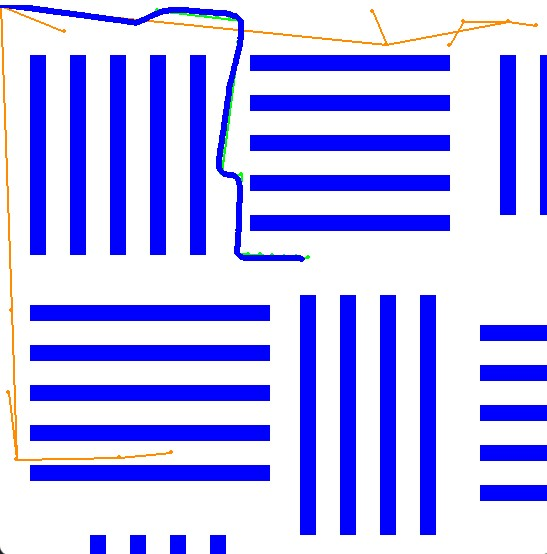
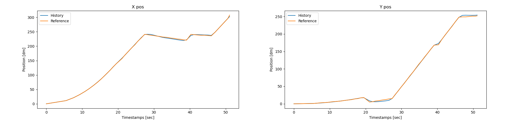
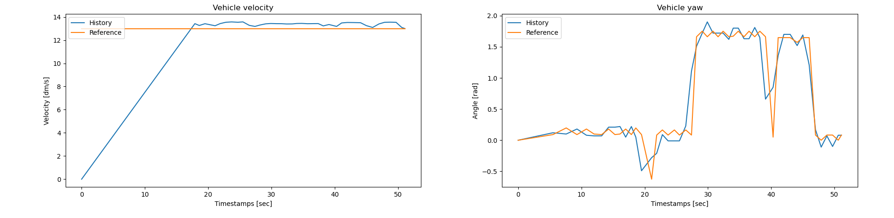
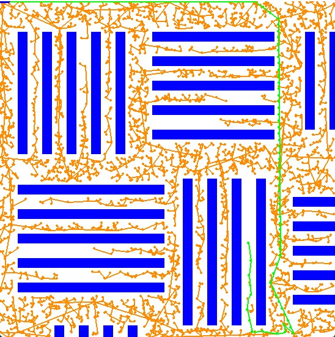

# RO47005 Project PDM Group 30
------------------------------
This file contains all the information and instructions related to the final assignment of the robot practical course.

## Practical information
------------------------------
This section contains some useful practical information.
Name                | Student Nr.
--------------------|-------------
Joris Weeda         | 5641551
Demi Breen          | 4591380
Kenny Brandon       | 4461428

## Introduction to the assignment
------------------------------
For the project, the chosen subject contains the implementation of a small four-wheel car as an automated guided vehicle (AGV). This vehicle will be used to navigate to a desired point within the area of a standard warehouse. The purpose of the autonomous vehicle is to improve the logistics of gathering the products. This can be done by transporting products, which are placed on and taken off by workers, to certain locations within the warehouse.

## Setup of the packages
------------------------------
There are three main packages which are combined in the main to create and support the automated vehicle in a simulated environment.
* PDM
  * _global_planner_
      * __init__.py
      * rrt.py
  * _local_planner_
      * __init__.py
      * mpc_controller.py
      * vehicle_dynamics.py
  * _map_environment_
      * __init__.py
      * environment.py
      * obstacles.py
  * _test_
      * mpc_test.py
      * rrt_test.py
  * _main.py_

A brief description of the content of every package (and folder).

#### Global planner
The global planner is responsible for creating waypoints from a given initial point (0, 0) to an ending point given by the user. Using RRT the algorithm samples coordinates in the configuration space and builds a tree in which a path to the goal can be constructed. There is an additional optimization rewiring option, which redefines the edges of RRT to be optimal to the defined node (using Prim's algorithm). Another optimization is the intermediate goal check, which after every valid sample checks if the end goal can be reached with the current set of nodes.

#### Local planner
The local planner is responsible for following the track with the constraints of the vehicle and environment. Using the cvx solver with a defined set of constraints, weights, states and cost the algorithm solves for a 'optimal' control vector which can be passed to the vehicle to update the state.

#### Environment
The environment creates and updates a simulated environment based on _pygame_.  It enables the option to draw obstacles coordinates and the progression of the car throughout the simulation.

#### Test
This folder contains a few tests which verified the first versions of RRT and MPC. Running main would be sufficient.

## Run the script
------------------------------
1. Make sure python is installed V3.8 < 
2. Clone or download this repository to your PC
3. Pip install the requirements.txt
4. Run main.py 

Additional runtime flags:
* rewire (bool) in build_roadmap, to redefine the edges between the set of nodes after RRT provide the roadmap.
* intermediate_goal_check (bool) in build_roadmap, to check after every valid sample if the endpoint can be reached.
* use_debug (bool) in main, to draw the full RRT nodes/edges and provide graphs of the vehicle dynamics after simulation is complete.

## Known bugs
------------------------------
There are a few known bugs to the current code implementation.
* Extensive runtime with rewiring. If the rewire option in RRT is set to True for 100+ nodes the computational effort is quite heavy, resulting nice fairly long runtime.
* MPC not solvable. In exceptional cases, which have yet to be determined, the MPC solver declines to provide a control vector. Due to lack of time we were not able to find/solve this problem.
* Index error in vehicle dynamics. In exceptional cases, the model prediction method in the vehicle dynamics returns an error. Due to lack of time we were not able to find/solve this problem.

## Example images
------------------------------
The _res_, short for resource, folder has some images which are displayed below to give a short impression on the result of running the solution.

### Example simulation
https://user-images.githubusercontent.com/45165354/212667802-c4b947cf-b920-4696-a01f-07e2741c741b.mp4

### Example of a run in simulation

### Corresponding position graphs of the example run

### Corresponding yaw and velocity graphs of the example run

### Example of dense RRT graph in simulation

